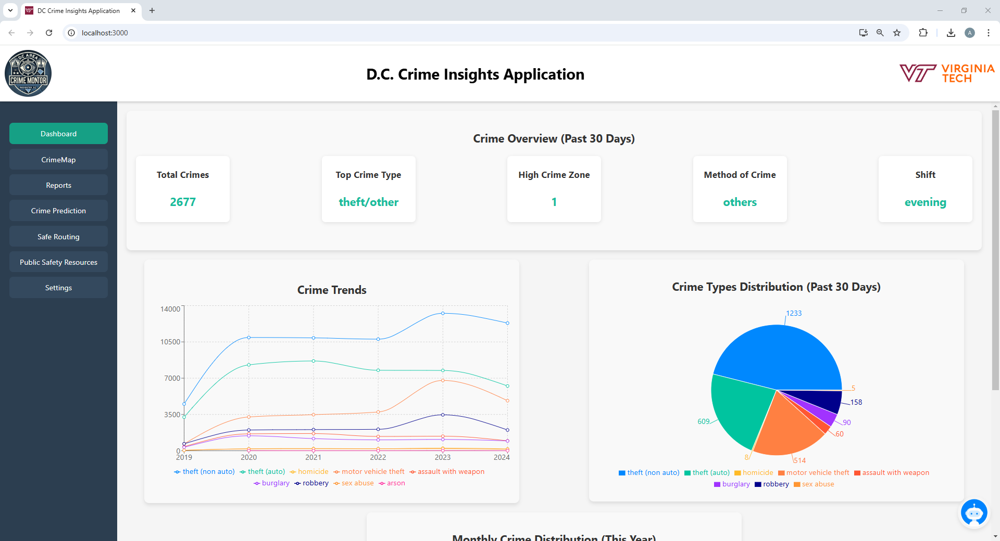
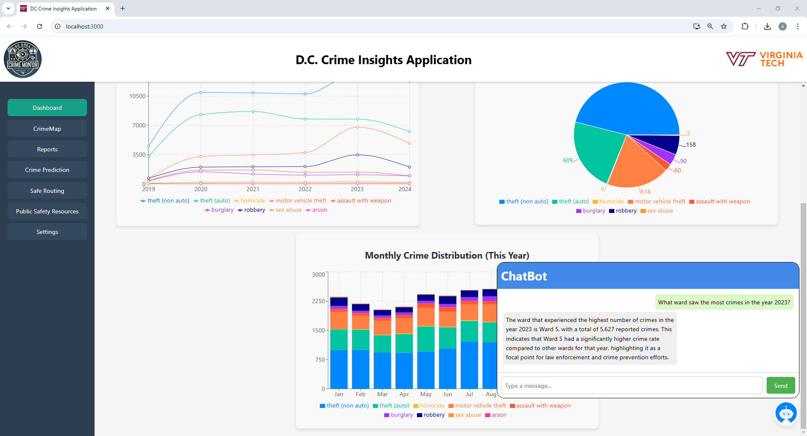
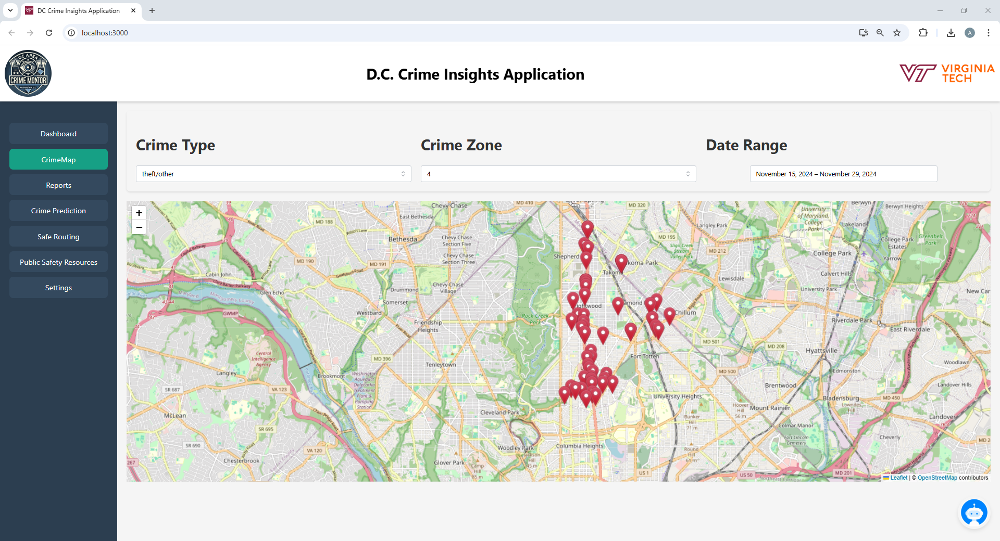
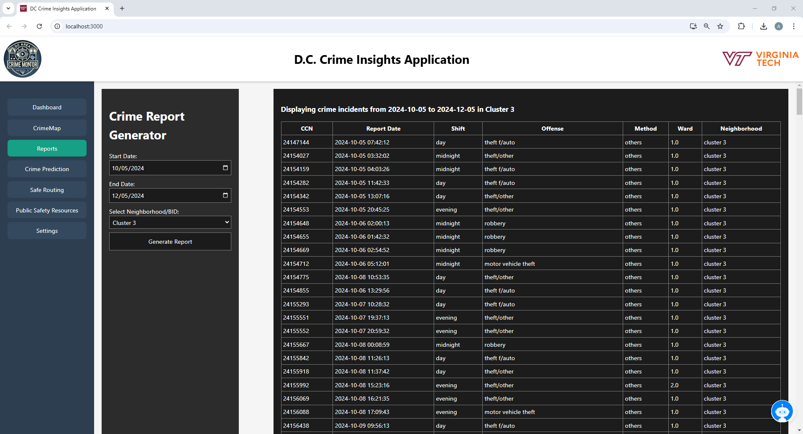
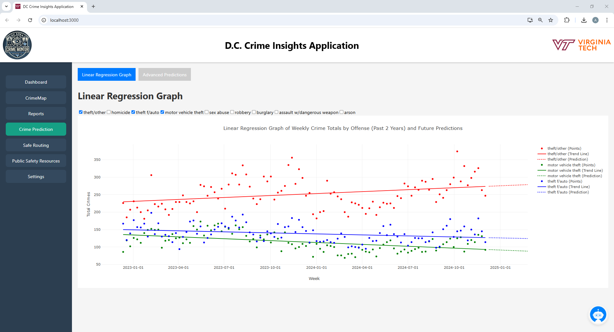
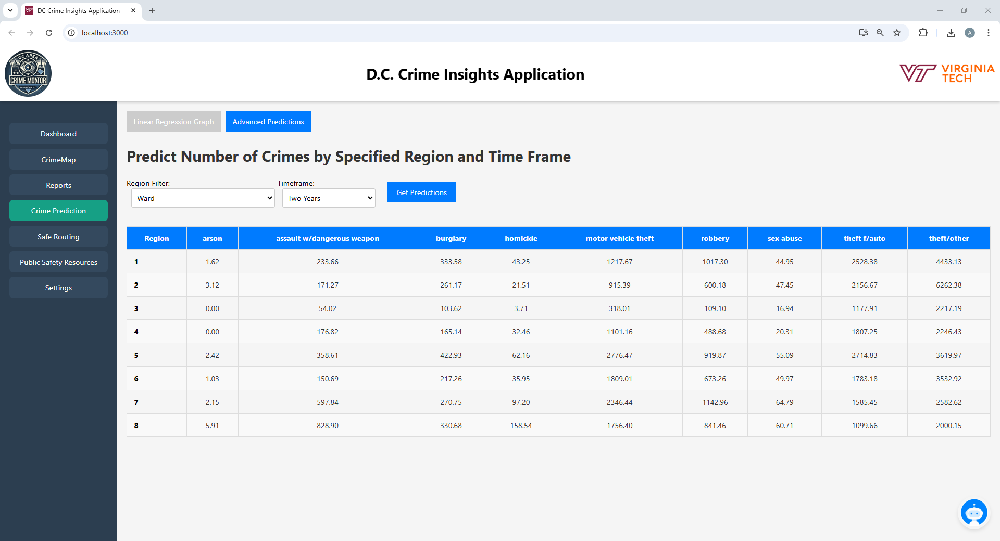
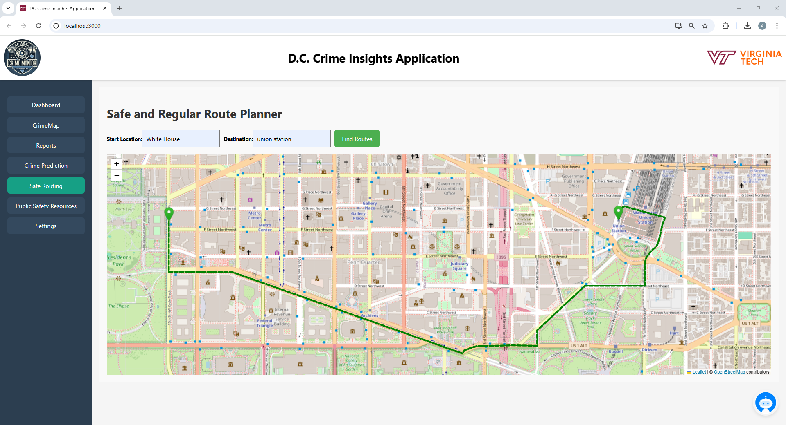
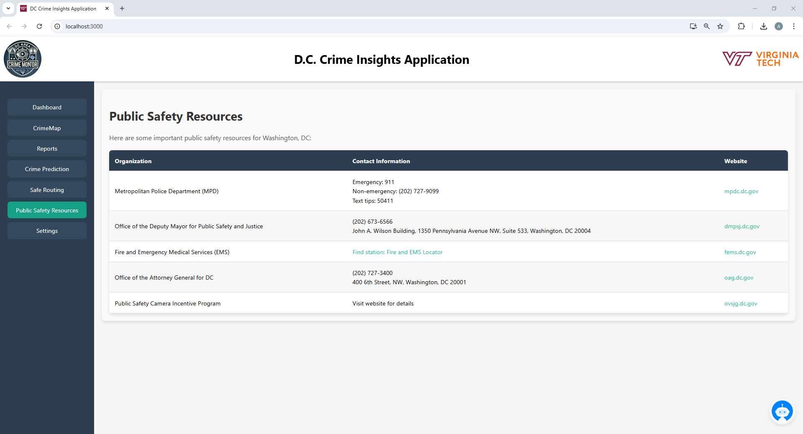
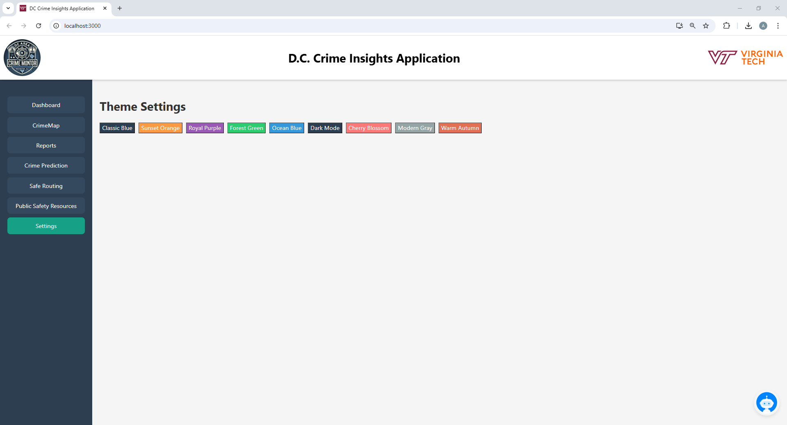

<<<<<<< HEAD

# D.C Crime Insights Application

## Before you Begin

Users planning on running this application should have Node.js and Python installed, as well as the latest versions of the Windows, Mac, or Linux operating systems.

## Description

The D.C. Crime Insights Application can be used to analyze valuable data regarding D.C. crime statistics. The application has multiple different pages that serve different functions.

### Features

- Dashboard: Provides high level information such as general statistics over the past 30 days, past 12 months, and Crime Trends over the past few years using a variety of different graphs to display information in a clean and concise format.
- CrimeMap: This page can be used to display crimes across D.C. and can filter crimes by the crime type, crime zone, and date range over the past 30 days.
- Reports: This page can take dates from a specified range, as well as a neighborhood cluster to generate a report of information regarding various data for the users on the webpage.
- Crime Prediction: This page contains two sections. The Linear Regression Graph tab contains a linear regression graph that can be used to help predict the number of crimes that will occur for a specific method in D.C. over the coming weeks. The Advanced Predictions tab can be used to predict the number of crimes over a certain timeframe for a specified region. Both of these tools are very valuable for helping users predict future crime trends.
- Safe Routing: This page takes start and destination locations and generates a safe route for the user to take by leveraging past crime data.
- Public Safety Resources: The page provides various resources users can look at to help report crimes or keep them safe.
- Settings: This page can be used to change the colors in the sidebar to help make the application look nicer.

Features Working in the Background of the Web Application:

- Live Database Hosted Using AWS: The database is currently hosted on Amazon RDS. All calls used to gather data in the application pull data from the tables hosted in the live database.
- Database Autoscheduler: This uses Amazon Lambda and Amazon EventBridge to automatically schedule updates to the database to add new crimes. The code used is in the backend section of the database but does not work if you try to run the Python file since its the code is built to be run using Amazon Lambda.

## Usage:

### Dashboard

Displays information for the Total Crimes, Top Crime Type, High Crime Zone, Method of Crime, and most common shift for crimes to occur over the past 30 days at the top of the application. Also displays a line graph for the number of crimes colored by the offense over 5-6 years, a pie chart showing the number of crimes colored by the offense over the past 30 days, and a bar chart showing the number of crimes for each month over the 2024 year.

---

### Chatbot

The chatbot allows users to ask questions and receive insights based on crime data from the database. This feature can be used to quickly retrieve information without navigating through the different parts of the Crime Insights Application. Here the user is getting a response to the question "What ward saw the most crimes in the year 2023?"

---

### Crime Map

The crime map allows users to view crimes on a map in the D.C. area. The user can filter by crime type, crime zone, and even crime dates as seen in the example where the user is filtering by theft/other for zone 4 over November 15, 2024 - November 29, 2024.

---

### Reports

The Crime Report Generator is used to return a view of all the crimes that occurred between certain dates for a neighborhood cluster. In this example, we are receiving all the crimes that occurred in neighborhood cluster 3 between the dates of 10/05/2024 and 12/05/2024.

---

### Crime Prediction (Linear Regression Graph)

The Linear Regression Graph on the Crime Prediction page displays a linear regression line for the number of crimes that occurred over a week for the given type of crime over the past two years. Additionally, there is a dotted line after the linear regression line that can be used to predict the number of crimes that will occur in the following weeks in the future, based on the type of crime. In the following example we filter by theft/other as well as theft f/auto and motor vehicle theft.

---

### Crime Prediction (Advanced Predictions)

The Advanced Predictions Page can be used to display the number of crimes predicted for the various types of crimes over a certain time frame for different regions. In the following example, we are predicting the number of crimes that will occur across different wards over the next two years. For example, we can indicate that Ward 8 is projected to see many more homicides over the next two years than Ward 2.

---

### Safe Routing

The safety routing page is used to generate a safe route for users to take based on historical crime data. In the following example, we create a route from the White House to Union Station using our safe routing feature to avoid high crime areas.

---

### Public Safety Resources

Resource Page is used to help connect people to organizations to report emergencies and crimes.

---

### Settings

Settings page is used to adjust the color of the sidebar.

---

## Tech Stack

### **Frontend**

- **Framework:** React.js (JavaScript)
- **UI Libraries:**
  - Mantine (for components like Select and DatePicker)
  - Leaflet & React-Leaflet (for interactive maps)
  - Plotly.js (for graphs and data visualization)
- **Styling:** CSS, Mantine custom themes

---

### **Backend**

- **Framework:** FastAPI (Python) - powers our API and backend services
- **Server:** Uvicorn - runs the backend application
- **Database:** MySQL (hosted on Amazon RDS)
- **Data Processing Libraries:**
  - Pandas, NumPy, SciPy (for data analysis)
  - Scikit-learn, XGBoost (for crime prediction models)
  - Geopy, Polyline (for location-based routing)
  - Pydantic (for data validation)

---

### **Cloud Services (AWS)**

- **Amazon RDS:** Hosts our live database
- **AWS Lambda:** Handles serverless computing tasks
- **Amazon EventBridge:** Automates database updates on a scheduled basis

---

### **Deployment & Version Control**

- **Version Control:** Git (GitLab for code management)
- **Deployment:** AWS EC2 (for hosting the application and backend services)
- **Task Automation:** AWS Lambda & EventBridge for automatic data updates

---

### Data Souce

Data Gathered and used for this project can be found at the following links:

- https://crimecards.dc.gov/
- API JSON Link: https://maps2.dcgis.dc.gov/dcgis/rest/services/FEEDS/MPD/MapServer/8/query?where=1%3D1&outFields=CCN,REPORT_DAT,SHIFT,LATITUDE,LONGITUDE,WARD,NEIGHBORHOOD_CLUSTER,ANC,PSA,VOTING_PRECINCT,METHOD,OFFENSE&outSR=4326&f=json&orderByFields=REPORT_DAT%20DESC&resultRecordCount=1000

## Installation

To run the code there are many dependencies that need to be installed from the terminal. Below is a list of these dependencies. Although we have tried to include all of them, there may be more that we have forgotten to include. If that is the case, your terminal should inform you which dependencies you need to install as you try launching the application.

### NPM Installs:

- npm install leaflet react-leaflet
- npm install leaflet
- npm install react-datepicker
- npm install date-fns
- npm install @mantine/core @mantine/dates
- npm install plotly.js-dist

---

### PIP Installs:

- pip install fastapi
- pip install uvicorn[standard]
- pip install mysql-connector-python
- pip install scikit-learn
- pip install xgboost
- pip install numpy
- pip install pandas
- pip install scipy
- pip install geopy
- pip install requests
- pip install polyline
- pip install pydantic
- pip install langchain

### Runing the application

1. Open up two terminals

2. In terminal 1:

   cd backend

   uvicorn main:app --reload

3. In terminal 2:

   npm start

## Project status

As of 12/11/2024, the team will no longer be working on the project. Additionally, the database will be shut down after the final project is graded because we are currently paying to use Amazon RDS resources by having it deployed on the internet. If you desire to fork the project, you should change the credentials in mysql.connector to connect to a new database and use the various functions defined in the crime_database.py file to create and populate the tables by downloading a .csv file from where we gathered our data from: https://crimecards.dc.gov/. However, the application must not be used for commercial use and must follow our creative license http://creativecommons.org/licenses/by-nc/4.0/.

## Support

The project was developed by Capstone Group 10 - CS 5934. For more information about the project, you can contact our professor ssibdari@vt.edu as team members emails will be deprecated in the near future. Additionally, you can view the repository: https://code.vt.edu/sungpeihsuan/crime-report-web-application

## Roadmap

Roadmap for future improvements to our application:

- We believe that it would be a good idea to use polynomial regression for different crime methods on the Crime Prediction Linear Regression Graph.

- Additionally, on the Safety Routing Page, we generate a new route for the user that takes into account crime data over the past 7 days. However, our application does not show the original route generated before taking into account the crime data. This may be a good feature to add to the application.

- The application currently does not support mobile devices. Making the application mobile-friendly would also be a great addition.

This is also the link to our group's Kanban board. Note that you may need to request to access it: https://venkata-chaitanya-kanakamedala.atlassian.net/jira/software/projects/CRWA/boards/2

## Contributing

Our team is open to contributions as long as they follow our license: http://creativecommons.org/licenses/by-nc/4.0/

The following is a link to our Gitlab repository: https://code.vt.edu/sungpeihsuan/crime-report-web-application

## Authors and acknowledgment

The following project was guided under Professor Soheil Sibdari

### Authors:

- Alex Marrero
- Ka Wai Wu
- Kuan-Fu Lin
- Pei-Hsuan Sung (Patty)
- Venkata Chaitanya Kanakamedala

## License

The following is the creative license for our project: http://creativecommons.org/licenses/by-nc/4.0/

This is the full legal code for our license: https://creativecommons.org/licenses/by-nc/4.0/legalcode.en

# Some More Information About Using React

## Getting Started with Create React App

This project was bootstrapped with [Create React App](https://github.com/facebook/create-react-app).

## Available Scripts

In the project directory, you can run:

### `npm start`

Runs the app in the development mode.\
Open [http://localhost:3000](http://localhost:3000) to view it in your browser.

The page will reload when you make changes.\
You may also see any lint errors in the console.

### `npm test`

Launches the test runner in the interactive watch mode.\
See the section about [running tests](https://facebook.github.io/create-react-app/docs/running-tests) for more information.

### `npm run build`

Builds the app for production to the `build` folder.\
It correctly bundles React in production mode and optimizes the build for the best performance.

The build is minified and the filenames include the hashes.\
Your app is ready to be deployed!

See the section about [deployment](https://facebook.github.io/create-react-app/docs/deployment) for more information.

### `npm run eject`

**Note: this is a one-way operation. Once you `eject`, you can't go back!**

If you aren't satisfied with the build tool and configuration choices, you can `eject` at any time. This command will remove the single build dependency from your project.

Instead, it will copy all the configuration files and the transitive dependencies (webpack, Babel, ESLint, etc) right into your project so you have full control over them. All of the commands except `eject` will still work, but they will point to the copied scripts so you can tweak them. At this point you're on your own.

You don't have to ever use `eject`. The curated feature set is suitable for small and middle deployments, and you shouldn't feel obligated to use this feature. However we understand that this tool wouldn't be useful if you couldn't customize it when you are ready for it.

## Learn More

You can learn more in the [Create React App documentation](https://facebook.github.io/create-react-app/docs/getting-started).

To learn React, check out the [React documentation](https://reactjs.org/).

### Code Splitting

This section has moved here: [https://facebook.github.io/create-react-app/docs/code-splitting](https://facebook.github.io/create-react-app/docs/code-splitting)

### Analyzing the Bundle Size

This section has moved here: [https://facebook.github.io/create-react-app/docs/analyzing-the-bundle-size](https://facebook.github.io/create-react-app/docs/analyzing-the-bundle-size)

### Making a Progressive Web App

This section has moved here: [https://facebook.github.io/create-react-app/docs/making-a-progressive-web-app](https://facebook.github.io/create-react-app/docs/making-a-progressive-web-app)

### Advanced Configuration

This section has moved here: [https://facebook.github.io/create-react-app/docs/advanced-configuration](https://facebook.github.io/create-react-app/docs/advanced-configuration)

### Deployment

This section has moved here: [https://facebook.github.io/create-react-app/docs/deployment](https://facebook.github.io/create-react-app/docs/deployment)

### `npm run build` fails to minify

This section has moved here: [https://facebook.github.io/create-react-app/docs/troubleshooting#npm-run-build-fails-to-minify](https://facebook.github.io/create-react-app/docs/troubleshooting#npm-run-build-fails-to-minify)

> > > > > > > 0ec4a39 (Initialize project using Create React App)
